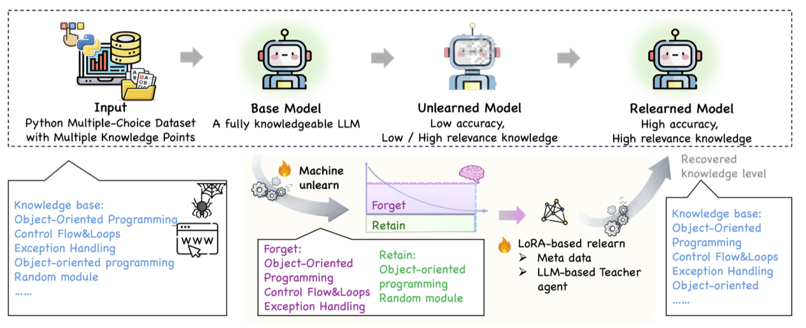
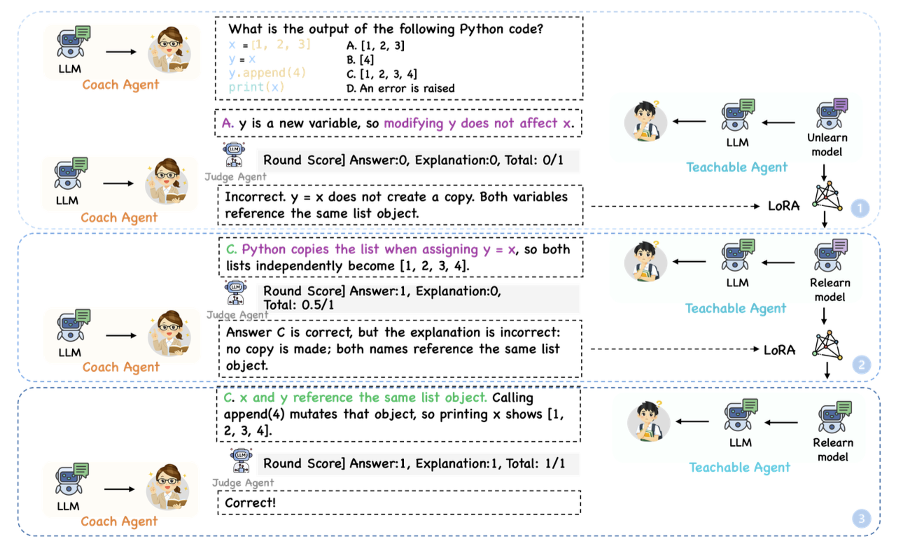

# Simulating Novice Students Using Machine Unlearning and Relearning in Large Language Models

## Overview

This project implements a framework for simulating novice student behavior in LLMs through a three-stage pipeline:

1. **Unlearning** -- Selectively erase targeted knowledge from a fully knowledgeable base model (Mistral-7B-Instruct-v0.3) using intervention-based distillation with LoRA.
2. **Relearning** -- Recover the forgotten knowledge via either standard LoRA fine-tuning or an LLM-based Teacher Agent that provides interactive, multi-turn feedback.
3. **Evaluation** -- Measure knowledge retention and recovery on both forgotten and retained topics using MCQ accuracy and F1 scores.

<p align="center">
  
</p>

## Requirements

- Python 3.8+
- CUDA-compatible GPU

## Installation

```bash
pip install -r requirements.txt
```

For LLM-guided relearning (Step 3 Option B), set the following environment variables:

```bash
export OPENAI_API_KEY="your-deepseek-api-key"
export OPENAI_BASE_URL="https://api.deepseek.com/v1"
```

## Usage

All training scripts use [Hydra](https://hydra.cc/) for configuration. Parameters can be overridden on the command line. The dataset supports progressive forget splits: `forget_10`, `forget_20`, ..., `forget_50` (representing 10%--50% of knowledge points).

### Step 1: Generate Teacher Distribution

Produce soft label distributions by feeding perturbed inputs (with incorrect answer options substituted) through the base model. This is a prerequisite for the unlearning step.

```bash
CUDA_VISIBLE_DEVICES=0 python teacher.py --config-name=forget_ai.yaml \
    data_path=data_construct/data/data_ai_progressive \
    split=forget_10
```

### Step 2: Unlearning

Train the model to forget targeted knowledge via intervention-based distillation:

```bash
CUDA_VISIBLE_DEVICES=0 python forget.py --config-name=forget_ai.yaml \
    data_path=data_construct/data/data_ai_progressive \
    split=forget_10 \
    lr=1e-4 \
    batch_size=8 \
    num_epochs=30 \
    teacher.N=3 \
    LoRA.r=32 \
    overwrite_dir=true \
    hydra.run.dir=.
```

The trained LoRA adapter is saved to `results/mistralai/Mistral-7B-Instruct-v0.3/intervention/{num_epochs}_{lr}_{split}/`.

Key parameters:

| Parameter | Description | Default |
|-----------|-------------|---------|
| `split` | Forget split (`forget_10` ... `forget_50`) | `forget` |
| `lr` | Learning rate | `1e-5` |
| `num_epochs` | Training epochs | `10` |
| `batch_size` | Per-device batch size | `16` |
| `teacher.N` | Number of incorrect options used as teacher targets | `3` |
| `LoRA.r` | LoRA rank | `8` |

### Step 3: Relearning

After unlearning, recover the forgotten knowledge through one of two methods.

**Option A -- Standard fine-tuning:**

```bash
python relearn.py --config-name=relearn_ai \
    model_path=results/mistralai/Mistral-7B-Instruct-v0.3/intervention/30_0.0001_forget_10 \
    split=forget_10 \
    num_epochs=10
```

**Option B -- LLM-guided multi-turn teaching (DeepSeek):**

```bash
python relearn_by_llm.py --config-name=relearn_ai_llm \
    model_path=results/mistralai/Mistral-7B-Instruct-v0.3/intervention/30_0.0001_forget_10 \
    split=forget_10
```

The LLM-guided approach uses a three-party interactive loop: a Coach Agent poses questions, the Teachable Agent (unlearned model) answers, and a Judge Agent evaluates. If incorrect, the model is immediately fine-tuned via LoRA before the next round (up to 4 rounds per question).

<p align="center">
  
</p>

### Step 4: Evaluation

Evaluate the model (either after unlearning or after relearning) on a held-out MCQ test set:

```bash
python evolution/eval_mistral_questions_test.py \
    --forget_adapter_dir ./results/mistralai/Mistral-7B-Instruct-v0.3/intervention/30_0.0001_forget_10
```

This compares the original base model and the target model on multiple-choice accuracy, and saves results to `eval_results.json` inside the adapter directory.

## Project Structure

```
.
├── forget.py                 # Unlearning training script
├── teacher.py                # Teacher distribution generation
├── relearn.py                # Standard relearning (LoRA fine-tuning)
├── relearn_by_llm.py         # LLM-guided relearning (DeepSeek)
├── eval_accuracy.py          # Accuracy evaluation on dataset splits
├── evaluate_util.py          # Evaluation utilities and metrics
├── data_module.py            # Dataset classes and data processing
├── dataloader.py             # Custom Trainer and data collators
├── utils.py                  # Utility functions
├── config/
│   ├── forget_ai.yaml        # Unlearning configuration
│   ├── relearn_ai.yaml       # Standard relearning configuration
│   ├── relearn_ai_llm.yaml   # LLM-guided relearning configuration
│   └── model_config.yaml     # Model-specific prompt templates
├── evolution/
│   ├── eval_mistral_questions_test.py  # MCQ accuracy evaluation
│   └── eval_f1.py                      # F1-score evaluation
├── data_construct/
│   ├── data/data_ai_progressive/       # Progressive forget splits (10%-50%)
│   └── raw_data/                       # Original question bank (Excel)
└── chat_analysis/
    ├── chat_learning_loop_2.py         # 3-party interactive learning system
    └── prompt/                         # Prompt templates for DeepSeek agents
```

## License

This project is licensed under the MIT License.
# Unlearn_and_Relearn
# Unlearn_and_Relearn
